# Turf Booking GDS — User-Centered Module Architecture

Version 0.9 — aligned on 2026-07-29 with the live Eraser MongoDB-only
production ERD. The live Eraser workspace is authoritative for persistence.

The architecture contains seven business modules around the system's users.
Media and Communications are shared infrastructure capabilities because their
data is embedded in owning ERD aggregates rather than stored in independent
business collections.

## Users

| User group | Users | Primary activities |
|---|---|---|
| Venue Users | Owner, Manager, Staff | Onboarding, KYC, venue setup, inventory, bookings, notifications, and payout visibility |
| Booking Partners | Partner applications and API consumers | Authentication, availability search, fixed-slot/open-time booking, cancellation, reporting, and webhooks |
| Platform Users | Admin, Operations, Support | Approvals, KYC review, contracts, support, financial close, and delivery operations |

## Architecture

```mermaid
flowchart TB
    subgraph TOP["Business Modules"]
        direction LR
        ID["<b>IDENTITY</b><br/>Admin, Venue User and Partner identity<br/>Embedded owner sessions<br/>Roles and permissions<br/>KYC and KYC documents<br/>API keys and usage<br/>Webhook endpoint registration"]
        VEN["<b>VENUE & INVENTORY</b><br/>Venues and courts<br/>Embedded venue/court media<br/>FIXED_SLOT · OPEN_TIME · BOTH<br/>Pricing and operating hours<br/>Durable Slot holds<br/>Interval availability<br/>Payout accounts"]
        CON["<b>CONTRACTS</b><br/>Partner–venue agreements<br/>Commission and tax terms<br/>Settlement cycles<br/>Allowed booking modes<br/>Cancellation terms<br/>Effective-dated versions"]
    end

    subgraph USERS["OUR USERS"]
        direction LR
        VU["Venue Users<br/>Owner · Manager · Staff"]
        BP["Booking Partners<br/>Partner App · API Consumer"]
        PU["Platform Users<br/>Admin · Operations · Support"]
    end

    subgraph BOTTOM["Business Modules"]
        direction LR
        BKG["<b>BOOKING</b><br/>Fixed-slot and open-time holds<br/>Booking confirmation<br/>Separate cancellation records<br/>Idempotency<br/>Contract snapshots<br/>Embedded booking audit history<br/>Inventory orchestration"]
        LED["<b>LEDGER</b><br/>Balanced entries<br/>Commission and tax posting<br/>Append-only history<br/>Reversals<br/>Settlement and payout links"]
        FIN["<b>FINANCIAL CLOSE</b><br/>Settlement generation<br/>Separate Reconciliation records<br/>Reconciliation attempt history<br/>Venue payouts<br/>Partner invoices<br/>KYC and payout-account gates"]
        ADM["<b>ADMIN ORCHESTRATION</b><br/>Onboarding and approvals<br/>KYC review<br/>Contract configuration<br/>Booking support<br/>Settlement and reconciliation<br/>Payout and delivery operations<br/><i>Owns no business data</i>"]
    end

    subgraph INFRA["Shared Infrastructure — Not Business Modules"]
        direction LR
        AUTH["Authentication Strategies"]
        DB["MongoDB Transactions"]
        REDIS["Redis Mirrors, Locks and Rate Limits"]
        MEDIA["Media Upload and Protected Access<br/><i>Metadata remains embedded</i>"]
        COM["Communications<br/>Outbox and embedded webhook delivery<br/>Embedded Venue User notifications"]
        OBS["Observability, Audit Context and Security"]
    end

    VU --- ID
    VU --- VEN
    VU --- BKG
    VU --- FIN

    BP --- ID
    BP --- VEN
    BP --- BKG
    BP --- FIN

    PU --- ID
    PU --- VEN
    PU --- CON
    PU --- BKG
    PU --- FIN
    PU --- ADM

    VEN -->|permission and KYC gates| ID
    VEN -->|media bytes| MEDIA
    BKG -->|availability and Slot state| VEN
    BKG -->|commercial terms and modes| CON
    BKG -->|financial entries| LED
    BKG -->|transactional events| COM
    FIN -->|aggregate and link entries| LED
    FIN -->|settlement terms| CON
    FIN -->|KYC| ID
    FIN -->|payout account| VEN
    FIN -->|financial events| COM
    ADM -->|delivery operations| COM
    COM -->|endpoint configuration| ID

    AUTH --> ID
    DB --> BKG
    DB --> FIN
    REDIS --> BKG
    OBS --> ADM

    classDef identity fill:#eee5ff,stroke:#7950b8,color:#24123d;
    classDef venue fill:#e3f7e9,stroke:#238636,color:#102f18;
    classDef contracts fill:#def7f3,stroke:#0f766e,color:#103936;
    classDef booking fill:#fff5cc,stroke:#ca8a04,color:#422006;
    classDef finance fill:#ffe3e3,stroke:#c92a2a,color:#3f1010;
    classDef admin fill:#eceff3,stroke:#59636e,color:#20262d;
    classDef infrastructure fill:#e1efff,stroke:#2563a6,color:#102a43;
    classDef users fill:#ffffff,stroke:#155eef,stroke-width:3px,color:#102a56;

    class ID identity;
    class VEN venue;
    class CON contracts;
    class BKG booking;
    class LED,FIN finance;
    class ADM admin;
    class AUTH,DB,REDIS,MEDIA,COM,OBS infrastructure;
    class VU,BP,PU users;
```



## Module Responsibilities

### 1. Identity

Identity owns:

- `AdminUser`
- `VenueOwner`
- `VenueOwnerMembership`
- `VenueRolePermission`
- `KycVerification`
- `KycDocument`
- `Partner`
- `PartnerApiKey`
- `ApiUsageDaily`
- `WebhookEndpoint`

Responsibilities:

- Register and authenticate every actor type.
- Keep hashed Venue User sessions embedded in `VenueOwner.sessions`.
- Manage roles, permissions, and venue memberships.
- Manage KYC and `KycDocument.file` metadata.
- Issue environment-specific Partner credentials.
- Authenticate API keys and HMAC signatures.
- Record API usage.
- Register and verify webhook endpoints.

### 2. Venue & Inventory

Venue owns:

- `Venue`
- `Court`
- `PricingRule`
- `Slot`
- `VenuePayoutAccount`

Responsibilities:

- Manage venue, court, pricing, and operating-hours data.
- Keep venue/court media metadata embedded.
- Support `FIXED_SLOT`, `OPEN_TIME`, and `BOTH`.
- Generate reusable fixed slots.
- Represent provisional open-time intervals.
- Persist fixed-slot hold fields on Slot.
- Prevent interval overlaps.
- Keep bounded inventory audit history embedded.
- Manage tokenized payout accounts.

### 3. Contracts

Contracts owns `PartnerVenueContract`.

Responsibilities:

- Manage commission, tax, and settlement-cycle terms.
- Define contract-allowed booking modes.
- Define cancellation, refund, and resale rules.
- Preserve effective-dated historical versions.
- Supply terms that Booking snapshots at confirmation.

### 4. Booking

Booking owns:

- `Booking`
- `BookingCancellation`
- `ApiIdempotencyRecord`

Responsibilities:

- Hold fixed-slot or open-time availability.
- Confirm all supported booking modes.
- Prevent fixed-slot and interval double booking.
- Make Partner mutations idempotent.
- Snapshot commercial and cancellation terms.
- Store booking audit history as an embedded bounded array.
- Store cancellation details in `BookingCancellation`.
- Coordinate Ledger posting and transactional Outbox insertion.

### 5. Ledger

Ledger owns `LedgerEntry`.

Responsibilities:

- Post balanced booking, commission, tax, and reversal entries.
- Preserve balance across partial-refund rounding.
- Validate reversal identity and financial scope.
- Post documented balanced adjustment entries.
- Preserve append-only financial history.
- Link entries directly to Settlement and Payout.
- Prevent general update and delete access.

### 6. Financial Close

Financial Close owns:

- `Settlement`
- `Reconciliation`
- `Payout`
- `Invoice`

Responsibilities:

- Generate settlement batches.
- Compare expected Settlement value with Partner-reported remittance.
- Store bank reference, evidence, status, notes, actor, and timestamps in a
  separate Reconciliation record.
- Keep detailed retries in `Reconciliation.attempt_history`.
- Complete Settlement after successful reconciliation.
- Enforce canonical active Owner BUSINESS KYC and verified payout-account
  gates.
- Create idempotent Venue payouts and record direct manual success/failure
  results.
- Expose strictly Venue-scoped owner Settlement/Payout history with masked
  account data and booking-level allocations.
- Insert Financial Close Outbox events transactionally.

Settlement adjustments, Partner statements, and structured Invoice
routes/services are implemented. Downloadable Invoice files remain deferred.
Communications consumes transactional events through its dedicated worker.

### 7. Admin Orchestration

Admin owns no collections.

Responsibilities:

- Actor, KYC, and venue approval workflows.
- Contract configuration.
- Booking and dispute operations.
- Settlement, Reconciliation, Payout, and Invoice operations.
- Communications delivery monitoring.
- Cross-module read-only reporting.
- Versioned Venue/Court support mutations delegated to Venue.
- Ledger-backed reports, bounded synchronous CSV, Booking dispute aggregation,
  and derived inventory-health monitoring.

Admin always calls the capability of the module that owns the data.
`ADMIN` owns mutations and exports; `OPS` and `SUPPORT` retain read-only
operational views, except for the explicit OPS Communications retry action.

## Shared Infrastructure

### Authentication

- Admin authentication
- Embedded Venue User sessions
- Partner API key and HMAC strategies

### MongoDB

- Transactions
- Validators and indexes
- Optimistic locking
- Reference checks
- Interval-overlap checks

### Redis

- Optional fixed-slot hold mirrors
- Open-time coordination locks
- Rate-limit counters

Redis is never persistent truth.

### Media

- Validate and upload file bytes.
- Return metadata for embedding in `KycDocument.file`, `Venue.media`, or
  `Court.media`.
- Generate protected access URLs.
- Own no business collection.

### Communications

- Create and claim `OutboxEvent` records.
- Store webhook delivery state and attempts in
  `OutboxEvent.webhook_deliveries`.
- Store dashboard notifications in `VenueOwner.notifications`.
- Store bounded device registrations in `VenueOwner.fcm_tokens` and use an
  optional FCM adapter after durable inbox insertion.
- Run a dedicated MongoDB-leased worker with crash recovery and bounded
  exponential retry.
- Sign outbound Partner webhooks and pin validated public DNS destinations to
  prevent SSRF and redirect bypass.
- Enforce environment-matched routing.

### Observability

- Logs, metrics, traces, alerts, audit context, and secret redaction.

## Boundary Rules

1. Use only collections defined by ERD v0.9.
2. Do not recreate removed standalone session, media, notification, delivery, or
   audit collections.
3. Keep Settlement and Reconciliation separate.
4. Keep cancellation details in `BookingCancellation`.
5. Persist fixed-slot holds on Slot; Redis may only mirror them.
6. Support `FIXED_SLOT`, `OPEN_TIME`, and `BOTH`.
7. Keep audit histories bounded and embedded.
8. Keep webhook delivery attempts bounded and embedded in OutboxEvent.
9. Keep dashboard notifications bounded and embedded in VenueOwner.
10. Never mix sandbox and production data.

## Implementation Folder Mapping

The TypeScript modular monolith uses feature subfolders without changing the
collection ownership above:

```text
src/modules/
├── identity/
│   ├── platform/    # AdminUser authentication and identity persistence
│   ├── owner/       # Venue User authentication, sessions and memberships
│   ├── partner/     # Booking Partner identity, credentials and webhooks
│   ├── kyc/         # Shared Venue User and Partner verification
│   └── shared/      # Identity request contexts and authorization hooks
├── venue/           # Venue and inventory-owned capabilities
└── admin/
    └── onboarding/  # Privileged cross-module orchestration; no repositories
```

`platform` refers to the Platform User actor group. Its persisted collection is
still `AdminUser`, as required by the SRS. The `admin` module must not contain a
repository for `AdminUser`, Venue, KYC, or any other business collection.
